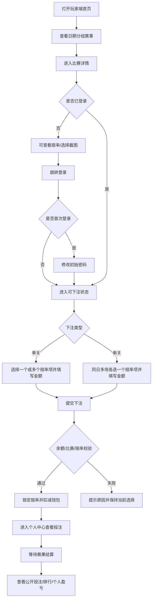
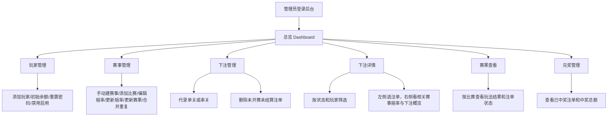
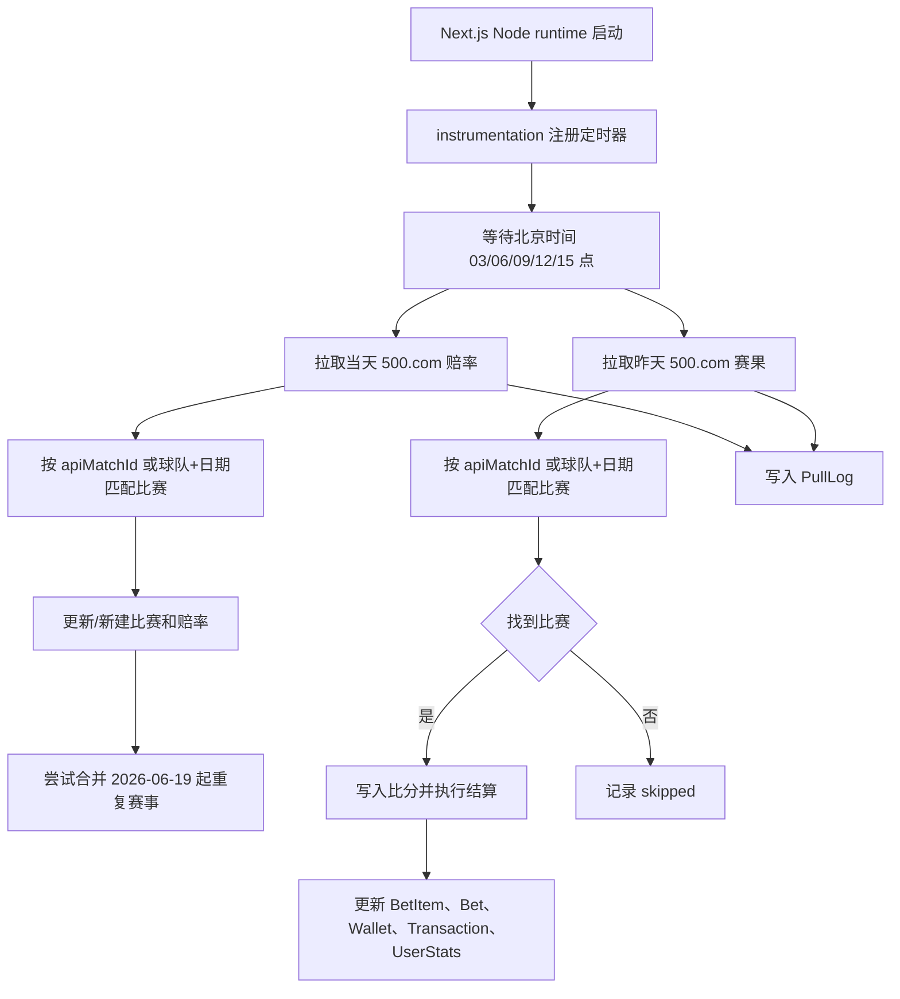

# 嗨起来 — 产品需求文档（PRD）

> 最后更新：2026-06-18  
> 版本：v2.5  
> 本次更新：根据当前项目代码重新校准产品文档。核心变化是：玩家端已经支持登录、修改初始密码、自主单关/串关下注；管理员后台保留代录、赛事、赛果、玩家、统计和中奖兑付清单能力；赔率/赛果主链路改为 500.com 抓取与进程内定时任务。

---

## 1. 产品概述

### 一句话定位

> 这是一个给朋友圈小规模玩家使用的移动优先 Web 竞猜平台，玩家可以查看世界杯赛程和赔率、登录后自主下注、查看公开投注记录和排行榜；管理员负责赛事数据、赔率、玩家、后台代录、赛果结算和统计管理。
> 与微信群 + Excel 的方式相比，核心差异是赔率自动展示、下注和结算流程在线化、公开记录透明可查、排名与盈亏自动计算。

### 产品形态

- **当前选型**：Web App，移动端优先，桌面端兼容。
- **玩家端形态**：底部 Tab 导航，主要适配手机访问。
- **管理员端形态**：桌面侧边栏 + 移动抽屉导航，支持手机后台管理。
- **选择理由**：朋友圈小规模传播以链接打开为主，无需下载安装；开发部署成本低；管理员可在桌面和手机上操作。

### 当前产品策略

**v2.4 之前文档描述**：用户端只读，玩家通过微信告诉管理员，管理员代录下注。  
**v2.5 当前代码现状**：玩家端已支持登录后自主下注，管理员后台仍支持代录和管理。

当前应按以下策略理解产品：

1. **玩家自主下注是主流程**：玩家使用管理员创建的用户名和初始密码登录，首次登录后必须修改密码，之后可在比赛详情页选择赔率下注。
2. **管理员代录是补充流程**：管理员可在后台为玩家录入单关或串关注单，适用于线下补录、纠错或代操作。
3. **所有下注公开透明**：玩家端“投注”页面展示全站投注记录；个人中心展示自己的投注记录。
4. **结算统一由赛果触发**：无论玩家自主下注还是管理员代录，最终都通过比赛结算逻辑更新下注结果、钱包和统计。

### 货币体系

- 平台使用虚拟货币，产品文案建议统一称为“记分”。
- 当前 UI 中也出现“积分”“奖励”等表达，后续应统一文案口径。
- 不接入在线支付，充值、扣减、中奖兑付均由管理员线下处理或后台调整。
- 玩家自主下注时会校验钱包余额并扣减；中奖后发放记分到钱包。

### 赔率与赛果来源

当前代码中存在两条数据链路：

| 链路 | 当前用途 | 说明 |
|------|----------|------|
| 500.com 抓取 | 当前主要链路 | 管理端手动更新赔率/赛果，进程内定时任务定时更新；只保留世界杯数据。 |
| API-Football | 保留的旧/备用链路 | 仍有 cron API、fixtures/odds/result 相关代码，需要 `CRON_SECRET` 调用。 |
| 本地 JSON/脚本导入 | 批量补充数据 | 管理端本地 JSON 导入；项目规范推荐在 `prisma/` 下写 TypeScript 导入脚本并用 `npx tsx` 执行。 |

500.com 当前支持玩法：

- 胜平负 `X1X`
- 让球胜平负 `HANDICAP_X1X`
- 半全场 `HALF_FULL`
- 总进球 `TOTAL_GOALS`
- 比分 `CORRECT_SCORE`

### 技术选型

| 项目 | 当前实现 |
|------|----------|
| 前端框架 | Next.js 16.2.7 + React 19 |
| 后端 | Next.js App Router API Routes |
| 数据库 | PostgreSQL + Prisma 7 |
| 鉴权 | Admin 使用 HTTP-only Cookie JWT；Player 使用 localStorage Bearer JWT |
| 密码 | 玩家密码使用 bcryptjs 哈希 |
| 部署 | Docker / Docker Compose |
| 定时任务 | Next instrumentation 注册进程内定时器；另保留 `/api/cron/*` 接口 |
| 数据抓取 | 500.com HTML 抓取为主，API-Football 作为旧/备用链路 |

---

## 2. 目标用户与使用场景

### 用户画像

| 角色 | 人数 | 特征 | 主要目标 |
|------|------|------|----------|
| 管理员 | 1 人 | 发起人、平台运营者 | 管理玩家、赛事、赔率、下注、赛果和兑付统计。 |
| 玩家 | 约 20 人 | 朋友圈球迷或娱乐参与者，手机访问为主 | 看赔率、下注、看公开投注、看排名和自己的盈亏。 |

### 典型使用场景

**场景 1：玩家登录并首次改密**

管理员在后台添加玩家，系统生成用户名、默认密码 `123456`、初始余额 2000。玩家打开“我的”页面后进入登录页，使用用户名和初始密码登录；若 `mustChangePwd=true`，系统强制跳转到修改密码页，设置至少 6 位新密码后进入个人中心。

**场景 2：玩家自主单关下注**

玩家在首页按日期选择比赛，进入比赛详情页，查看胜平负、让球胜平负、比分、总进球、半全场赔率。玩家登录后可多选同一场比赛的多个赔率选项，并为每个选项填写投注金额；提交后系统校验余额、锁定赔率、逐个生成单关注单并扣减钱包。

**场景 3：玩家自主串关下注**

玩家在比赛详情页切换到“串关”模式。系统展示同一比赛日仍可投注的比赛列表；每场最多选择一个赔率选项，至少选择 2 场。玩家填写串关金额后提交，系统计算综合赔率和预计赔付，创建一笔串关注单并扣减钱包。

**场景 4：管理员代录下注**

管理员进入后台“下注管理”，选择玩家、单关或串关模式，选择比赛和赔率项，录入金额后创建注单。该能力用于线下补录或代操作。当前代码中玩家自主下注会扣钱包；后台代录创建注单但未显式写入钱包扣款流水，此处属于待确认口径。

**场景 5：赔率/赛果自动拉取与结算**

系统进程启动后注册定时器，在北京时间 03:00、06:00、09:00、12:00、15:00 触发一次更新：拉取当天 500.com 世界杯赔率，拉取昨天赛果并结算。管理员也可在后台手动输入日期触发赔率或赛果更新，并查看拉取日志。

**场景 6：管理员查看统计和兑付清单**

管理员进入总览页查看总下注额、总赔付、平台盈利、用户排名，以及各玩家累计盈亏曲线、每日盈亏柱状图和当日明细。进入兑奖管理页可按玩家查看已中奖注单和中奖总额，用于线下兑付。

---

## 3. 核心用户动线

### 玩家主流程



### 管理员主流程



### 自动更新与结算流程



---

## 4. 功能清单

```
嗨起来
├── [P0] 玩家端
│   ├── 首页赛事列表
│   │   ├── 世界杯 Banner
│   │   ├── 世界杯倒计时
│   │   ├── 北京日期分组 Tab
│   │   ├── 比赛卡片：球队、时间、状态、比分、胜平负赔率
│   │   └── 点击进入赔率详情
│   ├── 比赛详情 / 下注
│   │   ├── 全玩法赔率展示：胜平负、让球、比分、总进球、半全场
│   │   ├── 未完赛时可选赔率；完赛后高亮命中选项
│   │   ├── 单关多选下注，每个选项单独金额
│   │   ├── 串关模式：同日多场，每场一个选项，至少 2 场
│   │   └── 未登录时引导登录
│   ├── 玩家登录与个人中心
│   │   ├── 用户名 + 密码登录
│   │   ├── 首次登录强制修改初始密码
│   │   ├── 查看个人投注、下注数、中奖数、盈亏
│   │   └── 退出登录
│   ├── 公共投注记录
│   │   ├── 全站投注公开列表
│   │   ├── 筛选：全部 / 已下注 / 已中奖 / 未中奖
│   │   └── 单关与串关卡片展示
│   └── 排行榜
│       ├── 总榜：按净盈利排序
│       ├── 投注额榜
│       ├── 命中率榜
│       └── 展示投注额、中奖额、积分/盈亏、命中率
│
├── [P0] 管理员后台
│   ├── 总览 Dashboard
│   │   ├── 总下注额、总赔付、平台盈利
│   │   ├── 已下注、已中奖、未中奖数量
│   │   ├── 可排序用户排名表
│   │   └── 玩家盈亏趋势图、每日柱状图、当日明细
│   ├── 下注管理
│   │   ├── 按状态查看下注列表
│   │   ├── 管理员代录单关
│   │   ├── 管理员代录串关
│   │   └── 删除未开赛且未结算下注
│   ├── 下注详情
│   │   ├── 按状态/玩家筛选
│   │   ├── 左侧注单列表
│   │   ├── 右侧赛事下注概览
│   │   └── 点击赔率选项高亮对应下注记录
│   ├── 玩家管理
│   │   ├── 添加玩家：用户名、昵称、默认密码、初始余额
│   │   ├── 修改昵称
│   │   ├── 修改余额
│   │   ├── 重置密码
│   │   ├── 禁用/启用玩家
│   │   └── 删除玩家及其关联数据
│   ├── 赛事管理
│   │   ├── 创建赛事
│   │   ├── 手动添加比赛
│   │   ├── 编辑全玩法赔率
│   │   ├── 手动结算/修改结算
│   │   ├── 500.com 手动更新赔率和赛果
│   │   ├── 本地 JSON 导入
│   │   ├── 合并重复赛事
│   │   └── 查看定时拉取日志
│   ├── 赛果查看
│   │   ├── 已完赛比赛列表
│   │   ├── 单场比分、玩法结果、投注汇总
│   │   ├── 当场下注明细
│   │   └── 串关待其它场次状态提示
│   └── 兑奖管理
│       ├── 已中奖注单列表
│       ├── 按玩家筛选
│       └── 中奖笔数与中奖总额汇总
│
├── [P1] 数据导入与调度
│   ├── 500.com 赔率抓取：手动 + 定时
│   ├── 500.com 赛果抓取：手动 + 定时
│   ├── PullLog 拉取日志
│   ├── 本地 JSON 导入
│   ├── TypeScript 脚本批量导入规范
│   └── API-Football 旧/备用 cron 接口
│
└── [P1] 公共能力
    ├── JWT 鉴权
    ├── bcrypt 玩家密码
    ├── 钱包与流水
    ├── 自动结算与重结算
    ├── 用户统计缓存
    ├── 球队别名归一
    └── 重复赛事合并
```

---

## 4.1 关键页面布局线框图

### 玩家端首页与比赛详情

```
┌───────────────────────────────┐
│ 世界杯 Banner                  │
├───────────────────────────────┤
│ 世界杯倒计时                    │
├───────────────────────────────┤
│ 日期 Tab：06/12 06/13 ...       │
├───────────────────────────────┤
│ 当日比赛列表                    │
│ ┌───────────────────────────┐ │
│ │ 小组赛 · 22:00 · 未开赛     │ │
│ │ 主队        VS        客队  │ │
│ │ 胜 2.10  平 3.20  负 3.00 │ │
│ └───────────────────────────┘ │
├───────────────────────────────┤
│ [赛事] [投注] [排名] [我的]     │
└───────────────────────────────┘

点击比赛后：

┌───────────────────────────────┐
│ 返回  赔率详情        [串关]    │
├───────────────────────────────┤
│ 比赛信息：赛事、时间、主客队      │
├───────────────────────────────┤
│ 已选投注区（登录且已选时显示）    │
│ 选项 / 赔率 / 金额步进 / 预计奖励 │
│ [确认投注]                     │
├───────────────────────────────┤
│ 胜平负                         │
│ 让球胜平负                      │
│ 比分                           │
│ 总进球                         │
│ 半全场                         │
└───────────────────────────────┘
```

### 管理员后台赛事管理

```
┌────────────────────────────────────────────────────────┐
│ 左侧导航：总览 / 下注 / 详情 / 玩家 / 赛事 / 赛果 / 兑奖 │
├──────────────┬─────────────────────────────────────────┤
│              │ 赛事管理标题 + 操作按钮                  │
│              │ [更新世界杯赔率] [更新赛果] [合并重复]    │
│              │ [本地导入] [+ 新建赛事]                  │
│              ├─────────────────────────────────────────┤
│              │ 赛事卡片                                 │
│              │ ┌─────────────────────────────────────┐ │
│              │ │ 2026 FIFA 世界杯                    │ │
│              │ │ 比赛数 / 已结算 / League / 赛季       │ │
│              │ ├─────────────────────────────────────┤ │
│              │ │ 历史比赛 · N 场（默认折叠）           │ │
│              │ │ 今日及明日比赛（默认展开）             │ │
│              │ │ 未来比赛 · N 场（默认折叠）           │ │
│              │ └─────────────────────────────────────┘ │
├──────────────┴─────────────────────────────────────────┤
│ 右侧：定时拉取日志（桌面 XL 展示；移动端 Sheet 展示）     │
└────────────────────────────────────────────────────────┘
```

### 管理员总览统计

```
┌──────────────────────────────────────────────┐
│ 总览 + 刷新                                  │
├──────────────────────────────────────────────┤
│ 总下注额 | 总赔付 | 平台盈利                 │
│ 已下注   | 已中奖 | 未中奖                   │
├──────────────────────────────────────────────┤
│ 用户排名表（桌面可点表头排序；移动端卡片）    │
├──────────────────────────────────────────────┤
│ 曲线筛选：全选 / 清空 / 玩家 Chips            │
├──────────────────────────────────────────────┤
│ 各玩家总投注盈亏每日曲线                      │
├──────────────────────────────────────────────┤
│ 各玩家每日盈亏柱状图                          │
├──────────────────────────────────────────────┤
│ 当日明细：玩家 / 当日投注 / 当日中奖额 / 盈亏 │
└──────────────────────────────────────────────┘
```

---

## 5. 功能详细描述

### 5.1 玩家账号与登录

**功能描述**：玩家账号由管理员创建。玩家用用户名和密码登录，首次登录需修改默认密码。玩家端 API 使用 Bearer JWT 鉴权。

**触发条件**：玩家进入 `/profile` 或在下注时未登录。

**交互细节**：

| 场景 | 交互处理方式 |
|------|--------------|
| 未登录进入个人中心 | 跳转 `/profile/login`。 |
| 登录成功 | 保存 `player_token` 到 localStorage；如必须改密则跳转 `/profile/change-password`，否则进入 `/profile`。 |
| 首次登录 | 强制修改密码，密码至少 6 位。 |
| 修改密码成功 | 提示“密码设置成功”，进入个人中心。 |
| 退出登录 | 二次确认后清除 localStorage token 并返回登录页。 |
| 账号不可用 | 登录接口统一返回“用户名或密码错误”或账号不可用相关错误。 |

**状态清单**：

| 状态 | 触发条件 | UI 表现 | 用户可执行操作 |
|------|----------|---------|----------------|
| 未登录 | 无 `player_token` | 登录表单 | 输入用户名和密码 |
| 首次登录待改密 | `mustChangePwd=true` | 修改密码页 | 设置新密码 |
| 已登录 | token 有效且用户 active | 个人中心 | 查看个人统计和投注，退出 |
| 禁用 | 用户 `status=DISABLED` | 登录失败或 API 不可用 | 联系管理员 |
| Token 失效 | API 返回 401 | 清除 token 并跳转登录 | 重新登录 |

**数据规范**：

| 字段名 | 数据类型 | 是否必填 | 默认值 | 说明 |
|--------|----------|----------|--------|------|
| username | string | 是 | - | 管理员创建，唯一，字母数字下划线。 |
| nickname | string | 是 | - | 玩家展示名。 |
| password | string hash | 是 | 123456 的 hash | bcrypt 哈希存储。 |
| mustChangePwd | boolean | 是 | true | 首次登录强制修改。 |
| role | enum | 是 | PLAYER | ADMIN / PLAYER。 |
| status | enum | 是 | ACTIVE | ACTIVE / DISABLED。 |

---

### 5.2 玩家赛事列表与赔率详情

**功能描述**：玩家首页按北京日期分组展示全部比赛；首页卡片突出比赛状态和胜平负赔率；比赛详情页展示完整玩法赔率并支持下注。

**触发条件**：玩家进入 `/` 或 `/match/[id]`。

**交互细节**：

| 场景 | 交互处理方式 |
|------|--------------|
| 首页加载中 | 显示“加载赛程中...” |
| 无赛事 | 显示“暂无赛事，等管理员添加赛事后就能看到了”。 |
| 日期切换 | 顶部日期 Tab 横向滚动，点击切换当日比赛。 |
| 比赛未开赛 | 展示赔率；可进入详情选择赔率。 |
| 比赛进行中/封盘 | 显示状态，不允许下注。 |
| 比赛已结束 | 首页展示比分；详情页高亮命中选项。 |
| 详情页未登录 | 允许查看赔率，提示“登录后可投注”。 |

**玩法展示**：

| 玩法 | optionKey 规范 | 展示 |
|------|----------------|------|
| 胜平负 | `home` / `draw` / `away` | 胜 / 平 / 负 |
| 让球胜平负 | `${handicap}:home/draw/away` | 如 `-1让胜` |
| 比分 | `1:0`、`2:1`、`胜其它` 等 | 精确比分和其它 |
| 总进球 | `0球` ~ `6球`、`7+` | 总进球格子 |
| 半全场 | `胜胜`、`胜平` 等 | 9 种半全场结果 |

**边界条件**：

- 比赛不存在：显示“比赛不存在”，可返回首页。
- 比赛已开赛或状态不是 `UPCOMING`：不可下注。
- 赔率缺失：对应玩法不展示或显示 `-`。
- 半全场赛果缺少半场比分：不能判定命中。

---

### 5.3 玩家自主下注

**功能描述**：玩家登录并完成初始密码修改后，可在比赛详情页提交单关或串关投注。系统锁定提交时数据库中的赔率，校验余额并扣减钱包。

**触发条件**：玩家在 `/match/[id]` 选择赔率并点击确认投注。

#### 单关下注

- 同一场比赛可选择多个赔率选项。
- 每个选项单独填写金额，默认金额 5，步进 5。
- 提交后每个选项生成一笔 `SINGLE` 注单。
- 钱包按选项金额逐笔扣减，生成 `BET` 流水，备注为“玩家投注”。

#### 串关下注

- 在详情页点击“串关”进入同日可串关比赛列表。
- 仅展示状态为 `UPCOMING` 且开赛时间晚于当前时间的同日比赛。
- 每场比赛最多选择一个赔率选项。
- 至少选择 2 场。
- 综合赔率 = 各项锁定赔率乘积后保留两位。
- 提交后生成一笔 `PARLAY` 注单，生成一条 `BET` 流水，备注为“玩家串关投注”。

**交互细节**：

| 场景 | 交互处理方式 |
|------|--------------|
| 未登录提交 | 跳转 `/profile/login`。 |
| 未改初始密码 | API 返回“请先修改初始密码”。 |
| 金额无效 | 提示“请输入有效投注金额”或“请为每个选项填写有效下注倍数”。 |
| 余额不足 | 提示“余额不足，无法投注”。 |
| 比赛不可投注 | 提示“比赛不可投注”或“所选比赛已不可投注，请重新选择”。 |
| 赔率变化/缺失 | 提示“投注项赔率已变化，请刷新后重试”。 |
| 投注成功 | 单关提示“投注成功”，串关提示“串关投注成功”，跳转个人中心。 |

**下注状态**：

| 状态 | 触发条件 | UI 文案 | 说明 |
|------|----------|---------|------|
| PENDING_REVIEW | 旧兼容状态 | 待审核 | 当前玩家/管理员创建默认不使用。 |
| APPROVED | 创建成功待结算 | 已下注 | 下注已生效。 |
| ACTIVE | 兼容状态 | 已下注 | 代码保留。 |
| WON | 结算命中 | 已中奖 | 钱包已发放中奖额。 |
| LOST | 结算未命中 | 未中奖 | 不再产生额外扣款。 |
| CANCELLED | 取消/拒绝 | 已取消 | 旧审核接口保留。 |

**数据规范**：

| 字段名 | 数据类型 | 是否必填 | 说明 |
|--------|----------|----------|------|
| betUid | string UUID | 是 | 对外展示唯一标识。 |
| userId | number | 是 | 玩家 ID。 |
| betMode | enum | 是 | SINGLE / PARLAY。 |
| totalAmount | decimal | 是 | 下注金额。 |
| lockedTotalOdds | decimal | 是 | 单关注单赔率或串关综合赔率。 |
| potentialPayout | decimal | 是 | 预计赔付。 |
| actualPayout | decimal/null | 否 | 结算后实际赔付。 |
| items | BetItem[] | 是 | 下注项。 |

---

### 5.4 公共投注记录、个人中心与排行榜

**公共投注记录**：

- 路由：`/bets`。
- 展示全站注单，强调“公开透明”。
- 支持筛选：全部、已下注、已中奖、未中奖。
- 顶部汇总：总下注数、已下注数、已中奖数、总下注额。
- 单关显示比赛、选项、赔率、投注额和预计奖励；串关显示每个串关项和综合赔率。

**个人中心**：

- 路由：`/profile`。
- 必须登录。
- 展示头像、昵称、下注数、中奖数、盈亏。
- 展示自己的投注记录，支持筛选：全部、已下注、已中奖、未中奖。
- 若 `mustChangePwd=true`，强制跳转改密页。

**排行榜**：

- 路由：`/ranking`。
- 数据来源：所有 `WON` / `LOST` 的已结算注单。
- 默认按净盈利排序。
- 支持切换：总榜、投注额、命中率。
- 顶部 Banner 上展示：投注额最高、净盈利最高、命中率最高玩家。

**统计口径**：

| 指标 | 计算方式 |
|------|----------|
| totalBets | 已结算注单数量。 |
| totalWonBets | `status=WON` 的注单数量。 |
| totalBetAmount | 已结算注单本金合计。 |
| totalWinAmount | 已结算注单实际赔付合计。 |
| netProfit | `totalWinAmount - totalBetAmount`，玩家视角。 |
| winRate | `totalWonBets / totalBets`。 |

---

### 5.5 管理员后台总览与统计图表

**功能描述**：管理员总览展示平台级经营数据、用户排名和玩家每日盈亏趋势。

**触发条件**：管理员进入 `/admin`。

**核心卡片**：

| 卡片 | 口径 |
|------|------|
| 总下注额 | 全部 Bet 的 totalAmount 合计。 |
| 总赔付 | 全部 Bet 的 actualPayout 合计。 |
| 平台盈利 | `总下注额 - 总赔付`，平台视角。 |
| 已下注 | `status=APPROVED` 数量。 |
| 已中奖 | `status=WON` 数量。 |
| 未中奖 | `status=LOST` 数量。 |

**用户排名表**：

- 展示昵称、投注额、中奖额、总购买场次、中奖场次、投注盈亏、中奖率、回报率。
- 桌面端点击表头排序。
- 移动端使用排序 Chips 和卡片列表。

**PlayerProfitCharts**：

| 图表 | 说明 |
|------|------|
| 曲线筛选 | 按玩家显示/隐藏曲线，全选/清空。 |
| 总投注盈亏每日曲线 | 玩家累计盈亏曲线，可点击日期切换下方明细。 |
| 每日盈亏柱状图 | 玩家每日盈亏分组柱状图，正负方向区分。 |
| 当日明细 | 展示玩家、当日投注、当日中奖额、当日盈亏、累计盈亏。 |

**图表数据口径**：

- 起始日期：`2026-06-12`。
- 只统计未禁用玩家。
- 只统计已结算注单：`status in (WON, LOST)`。
- 按 `settledAt` 的北京时间日期聚合。
- 当日投注 = 当日结算注单 `totalAmount` 合计。
- 当日中奖额 = 当日结算注单 `actualPayout` 合计。
- 当日盈亏 = 当日中奖额 - 当日投注。
- 累计盈亏 = 从起始日期累加每日盈亏。

---

### 5.6 管理员下注管理与下注详情

#### 下注管理

**功能描述**：管理员可查看注单列表，并为玩家代录单关或串关注单。

**触发条件**：管理员进入 `/admin/bets`。

**功能细节**：

| 功能 | 当前实现 |
|------|----------|
| 状态筛选 | 已下注、已中奖、未中奖。 |
| 单关代录 | 选择玩家、比赛、赔率项和金额；多个单关选择会逐项创建注单。 |
| 串关代录 | 选择玩家、多个比赛，每场一个赔率项，填写总金额后创建一笔串关注单。 |
| 删除注单 | 仅允许删除未结算且关联比赛未开赛的注单。 |
| 移动端 | 列表/表单双 Tab，离开未保存表单会确认。 |

**待确认差异**：玩家自主下注会扣减钱包并写流水；后台代录当前创建 Bet/BetItem，但未显式扣减钱包和写 `BET` 流水。产品上需确认后台代录是否也必须扣减玩家余额。

#### 下注详情

**功能描述**：按注单查看完整下注信息，并在右侧以赛事为单位展示赔率与下注概览。

**触发条件**：管理员进入 `/admin/bet-details`。

**交互细节**：

| 场景 | 交互处理 |
|------|----------|
| 筛选 | 支持全部、已下注、已中奖、未中奖，以及按玩家筛选。 |
| 选择注单 | 左侧点击注单，右侧展示该注单相关赛事的概览。 |
| 赛事分组 | 右侧只展示当前选中注单涉及的比赛，但统计记录来自当前筛选结果。 |
| 赔率详情 | 当前筛选结果中有人下注的赔率选项标红。 |
| 点击赔率 | 高亮右侧下注详情中 matchId + betMarket + selectedOption 匹配的记录。 |
| 移动端 | 选中注单后隐藏左侧列表，聚焦详情区域。 |
| 空状态 | 无下注记录时显示“暂无下注记录”。 |

---

### 5.7 管理员玩家管理

**功能描述**：管理员维护玩家账号、余额和状态。

**触发条件**：管理员进入 `/admin/players`。

**功能细节**：

| 功能 | 当前实现 |
|------|----------|
| 添加玩家 | 填写用户名和昵称；用户名只允许字母数字下划线。 |
| 初始密码 | 默认 `123456`，玩家首次登录必须修改。 |
| 初始余额 | 创建钱包，初始余额 2000。 |
| 修改昵称 | 桌面端内联编辑，移动端 Sheet。 |
| 修改余额 | 直接设置余额为指定非负数字。 |
| 重置密码 | 重置为 `123456`，并设置 `mustChangePwd=true`。 |
| 禁用/启用 | 修改 `status`。 |
| 删除玩家 | 删除玩家关联交易、注单、下注项和用户。 |

**边界条件**：

- 用户名重复：返回“用户名已存在”。
- 用户名格式错误：返回“用户名只能包含字母、数字和下划线”。
- 余额小于 0：返回错误。
- 删除玩家会清除关联数据，需谨慎操作。

---

### 5.8 管理员赛事、赔率、赛果与拉取日志

**功能描述**：管理员维护赛事、比赛、赔率和赛果，支持手动导入、500.com 抓取、重复赛事合并和定时日志查看。

**触发条件**：管理员进入 `/admin/tournaments`。

**比赛列表分组**：

| 分组 | 判断口径 | 默认状态 |
|------|----------|----------|
| 历史比赛 | 开赛时间 < 今日北京时间 0 点 | 折叠 |
| 今日及明日 | 今日北京时间 0 点 <= 开赛时间 < 后天北京时间 0 点 | 展开 |
| 未来比赛 | 开赛时间 >= 后天北京时间 0 点 | 折叠 |

**赛事管理操作**：

| 操作 | 当前实现 |
|------|----------|
| 新建赛事 | 名称、League ID、赛季、开始/结束日期。 |
| 添加比赛 | 主队、客队、开赛时间。 |
| 编辑赔率 | 支持胜平负、让球胜平负、半全场、总进球、比分。 |
| 手动结算 | 填写半场比分、90 分钟全场比分、最终比分；全场比分用于结算。 |
| 更新世界杯赔率 | 输入日期，抓取 500.com 当天世界杯赔率。 |
| 更新赛果 | 输入日期，抓取 500.com 当天赛果并自动结算。 |
| 合并重复赛事 | 合并 2026-06-19 起重复赛事，保留最新 oddsUpdatedAt 或最大 id 的比赛。 |
| 本地数据导入 | 粘贴 JSON 导入比赛和赔率。 |
| 定时拉取日志 | 查看 SCHEDULED PullLog，包含赔率和赛果拉取记录。 |

**500.com 赔率导入规则**：

- 抓取 playid 269/270/271/272，对应基础胜平负/让球、总进球、比分、半全场。
- 只保留 `data-simpleleague=世界杯` 的比赛。
- 使用 `500-${matchNo}` 作为 `apiMatchId`。
- 优先按 `apiMatchId` 匹配；未命中时按球队归一名 + 北京日期模糊匹配。
- 更新已有比赛时会删除该比赛旧赔率并批量写入新赔率。
- 新建比赛时当前默认写入 `tournamentId=1`。
- 导入完成后尝试执行重复赛事合并。

**500.com 赛果导入规则**：

- 只保留世界杯赛果。
- 优先按 `500-${matchNo}` 匹配；未命中时按球队归一名 + 北京日期匹配。
- 匹配成功后调用统一结算逻辑。
- 未匹配或无需处理时记录 skipped。

**定时任务规则**：

- 注册位置：Next instrumentation 的 Node runtime。
- 触发时间：北京时间 03:00、06:00、09:00、12:00、15:00。
- 每次执行：抓取当天赔率、抓取昨天赛果。
- 每次写入 PullLog，记录 batchId、source、trigger、kind、status、统计数和 items。

**重复赛事合并规则**：

- 起始日期：`2026-06-19`。
- 分组 key：北京日期 + 主队归一名 + 客队归一名。
- 保留项：优先保留 `oddsUpdatedAt` 最新的比赛；若相同保留 id 最大的比赛。
- 对被删除比赛上的 BetItem 执行迁移；如迁移后同一注单产生重复 matchId 项，则清理冲突项。

---

### 5.9 管理员赛果查看

**功能描述**：按已结束比赛查看比分、玩法结果、当场投注明细和汇总。

**触发条件**：管理员进入 `/admin/results`。

**列表字段**：

| 字段 | 说明 |
|------|------|
| 比赛信息 | 主队、客队、赛事名、开赛时间。 |
| 比分 | 半场、90 分钟全场、最终比分。 |
| betCount | 相关注单数量。 |
| betItemCount | 相关下注项数量。 |
| winCount / loseCount | 当场已判定的赢/输下注项数量。 |
| pendingItemCount | 仍待结算下注项数量。 |
| openBetCount | 注单整体仍未结算数量。 |
| totalBetAmount / totalPayout | 当场相关总投注与总赔付。 |

**详情能力**：

- 展示胜平负、让球胜平负、比分、总进球、半全场的实际赛果。
- 展示当场全部 BetItem，包含玩家、注单类型、玩法、选项、赔率、结果。
- 对串关中本场已结算但注单整体等待其他比赛的情况显示“串关待完赛”。
- 缺少半场比分时，半全场结果无法判定。

---

### 5.10 自动结算与钱包流水

**功能描述**：比赛结算时更新 Match、BetItem、Bet、Wallet、Transaction 和 UserStats。

**结算触发**：

- 管理员在赛事管理中手动结算。
- 管理员手动抓取 500.com 赛果。
- 进程内定时任务抓取 500.com 赛果。
- 旧/备用 `/api/cron/results` 通过 API-Football 拉取结果。

**玩法判定**：

| 玩法 | 判定规则 |
|------|----------|
| 胜平负 | 90 分钟全场比分判断 home/draw/away。 |
| 让球胜平负 | 主队比分 + handicap 后判断 home/draw/away。 |
| 半全场 | 半场结果 + 全场结果组成，如 `胜平`。 |
| 总进球 | 全场总进球匹配 `0球`、`1球` 或 `7+` 等。 |
| 比分 | 精确比分或 `胜其它` / `平其它` / `负其它`。 |

**结算流程**：

1. 更新比赛比分和状态为 `FINISHED`。
2. 若允许重结算，先回退已中奖注单的钱包发放并写 `ADJUST` 流水，重置下注状态。
3. 逐个 BetItem 判定 `WON` / `LOST`。
4. 对每个相关 Bet：
   - 所有关联项都已结算后才更新注单整体状态。
   - 全部 BetItem 命中则 Bet 为 `WON`。
   - 任一 BetItem 未命中则 Bet 为 `LOST`。
5. Bet 中奖时发放 `totalAmount × lockedTotalOdds` 到钱包，并写 `WIN` 流水。
6. 更新该用户 UserStats。

**边界条件**：

- 有半全场下注但缺少半场比分：禁止结算。
- 自动结算时若比赛已有已结算注单且 `allowResettle=false`：跳过并报错。
- 手动结算允许重结算，会先做回退再重算。
- 串关只在所有关联比赛都有结果后更新整体中奖/未中奖。

---

### 5.11 兑奖管理

**功能描述**：当前“兑奖管理”不是独立申请/审核流，而是已中奖注单的兑付清单，用于管理员线下兑付核对。

**触发条件**：管理员进入 `/admin/redemptions`。

**当前实现**：

| 功能 | 说明 |
|------|------|
| 数据来源 | `status=WON` 的 Bet。 |
| 列表字段 | betUid、玩家昵称、下注金额、综合赔率、中奖额、比赛、选项、结算时间。 |
| 筛选 | 按玩家昵称筛选。 |
| 汇总 | 中奖笔数、中奖总额。 |

**待确认**：是否需要真正的 Redemption 模型、玩家发起兑奖申请、管理员审核通过/拒绝、兑奖后扣减余额等完整流程。当前数据库 schema 中没有独立 Redemption 表。

---

## 6. 数据模型

### 6.1 User / Wallet / Transaction

| Model | 关键字段 | 说明 |
|-------|----------|------|
| User | username、nickname、phone、password、mustChangePwd、avatar、role、status | 玩家和管理员用户；管理员登录当前主要用环境变量，不依赖数据库 admin。 |
| Wallet | userId、balance | 玩家钱包余额。 |
| Transaction | userId、type、amount、balanceAfter、relatedBetId、operatorId、remark、createdAt | 钱包流水。 |
| UserStats | totalBets、totalWonBets、totalBetAmount、totalWinAmount、netProfit | 用户统计缓存，结算后更新。 |

### 6.2 Tournament / Match / Odds

| Model | 关键字段 | 说明 |
|-------|----------|------|
| Tournament | name、leagueId、season、startDate、endDate、status | 赛事，如 2026 世界杯。 |
| Match | apiMatchId、homeTeam、awayTeam、logos、kickoffTime、status、比分字段、oddsUpdatedAt | 单场比赛。 |
| Odds | matchId、betType、optionKey、oddsValue | 唯一约束：matchId + betType + optionKey。 |

### 6.3 Bet / BetItem / PullLog

| Model | 关键字段 | 说明 |
|-------|----------|------|
| Bet | betUid、userId、betMode、totalAmount、status、lockedTotalOdds、potentialPayout、actualPayout、rejectReason、settledAt | 注单主体。 |
| BetItem | betId、matchId、betMarket、selectedOption、lockedOdds、result、settledAt | 注单明细；串关一笔 Bet 对应多个 BetItem。 |
| PullLog | batchId、source、trigger、kind、status、importDate、fetched/updated/created/settled/skipped、items、startedAt、finishedAt | 赔率/赛果拉取日志。 |

### 6.4 枚举

| 枚举 | 值 |
|------|----|
| Role | ADMIN、PLAYER |
| UserStatus | ACTIVE、DISABLED |
| TournamentStatus | UPCOMING、ACTIVE、FINISHED |
| MatchStatus | UPCOMING、LIVE、SEALED、FINISHED、CANCELLED、POSTPONED |
| BetType | X1X、HANDICAP_X1X、HALF_FULL、TOTAL_GOALS、CORRECT_SCORE |
| TxType | RECHARGE、BET、WIN、REFUND、ADJUST |
| BetMode | SINGLE、PARLAY |
| BetStatus | PENDING_REVIEW、APPROVED、ACTIVE、WON、LOST、CANCELLED |
| BetItemResult | PENDING、WON、LOST、CANCELLED |
| PullLogTrigger | MANUAL、SCHEDULED |
| PullLogKind | ODDS、RESULTS |
| PullLogStatus | SUCCESS、FAILED |

---

## 7. API 路由清单

### 玩家/公共 API

| 路由 | 方法 | 用途 |
|------|------|------|
| `/api/matches` | GET | 获取比赛和赔率列表，支持 tournamentId/date 查询。 |
| `/api/bets` | GET | 获取注单列表；`mine=1` 时取当前玩家注单。 |
| `/api/bets` | POST | 玩家自主单关/串关下注。 |
| `/api/ranking` | GET | 获取排行榜。 |
| `/api/profile` | GET | 获取当前玩家信息、钱包、统计。 |
| `/api/auth/player-login` | POST | 玩家用户名密码登录，返回 60 天 token。 |
| `/api/auth/me` | GET | 检查玩家 token 登录态。 |
| `/api/auth/change-password` | POST | 玩家修改初始密码。 |
| `/api/auth/login` | POST | 管理员登录，写入 Cookie token。 |
| `/api/auth/logout` | POST | 管理员退出。 |

### 管理员 API

| 路由 | 方法 | 用途 |
|------|------|------|
| `/api/admin/stats` | GET | 总览统计、用户排行、图表数据。 |
| `/api/admin/players` | GET/POST/PATCH/DELETE | 玩家列表、添加、修改、删除。 |
| `/api/admin/bets` | GET/POST/PATCH/DELETE | 注单列表、管理员代录、旧审核接口、删除。 |
| `/api/admin/tournaments` | GET/POST | 赛事列表和创建。 |
| `/api/admin/tournaments/dedup` | POST | 合并重复赛事。 |
| `/api/admin/matches` | POST | 手动添加比赛。 |
| `/api/admin/matches/settle` | POST | 手动结算/重结算比赛。 |
| `/api/admin/odds` | POST | 编辑赔率。 |
| `/api/admin/results` | GET | 赛果查看列表/详情。 |
| `/api/admin/redemptions` | GET | 已中奖注单兑付清单。 |
| `/api/admin/pull-logs` | GET | 拉取日志。 |
| `/api/admin/import/500` | POST | 手动抓取 500.com 赔率。 |
| `/api/admin/import/results` | POST | 手动抓取 500.com 赛果并结算。 |
| `/api/admin/import/local` | POST | 本地 JSON 导入比赛与赔率。 |
| `/api/admin/import/fixtures` | POST | API-Football fixtures 导入。 |
| `/api/admin/import/match` | POST | 单场导入相关接口。 |

### Cron / 备用 API

| 路由 | 方法 | 用途 |
|------|------|------|
| `/api/cron/odds` | POST | API-Football 拉取次日赔率；需要 `x-cron-secret`。 |
| `/api/cron/results` | POST | API-Football 检查 SEALED/LIVE 比赛赛果并结算；需要 `x-cron-secret`。 |
| `/api/cron/seal` | POST | 将已开赛 UPCOMING 比赛标记为 SEALED；需要 `x-cron-secret`。 |

---

## 8. 文案规范

### 8.1 风格基调

- 整体风格：轻松直接，适合朋友圈娱乐竞猜。
- 玩家端：有趣但不含糊，重点突出“投注、预计奖励、中奖、排名”。
- 管理端：清晰准确，优先说明操作后果。

### 8.2 推荐统一文案

| 场景 | 当前/推荐文案 | 备注 |
|------|---------------|------|
| 平台名 | 嗨起来 | 保持。 |
| 虚拟货币 | 记分 | 建议替代“积分/奖励”的混用。 |
| 未登录提示 | 登录后可投注 | 当前详情页已有类似文案。 |
| 首次登录 | 首次登录需要修改初始密码 | 当前已实现。 |
| 单关成功 | 投注成功 | 当前已实现。 |
| 串关成功 | 串关投注成功 | 当前已实现。 |
| 余额不足 | 余额不足，无法投注 | 当前 API 文案。 |
| 比赛不可投注 | 所选比赛已不可投注，请重新选择 | 当前 API 文案。 |
| 赔率变化 | 投注项赔率已变化，请刷新后重试 | 当前 API 文案。 |
| 历史比赛折叠 | 历史比赛 · N 场 | 当前赛事管理。 |
| 未来比赛折叠 | 未来比赛 · N 场 | 当前赛事管理。 |
| 当日无比赛 | 今日及明日暂无比赛 | 当前赛事管理后台口径。 |

### 8.3 需要统一的文案问题

- 玩家端 `/bets` 仍显示“管理员统一录入”，但当前玩家端已支持自主下注；建议改为“所有下注公开透明”。
- 货币文案在“记分 / 积分 / 奖励”之间混用；建议统一为“记分”，中奖展示可用“奖励”。

---

## 9. 非功能性需求

| 项目 | 要求 |
|------|------|
| 性能 | 移动端首屏目标 < 2s；列表与统计接口小规模用户下目标 < 1s。 |
| 规模 | 约 20 名玩家，世界杯期间小流量使用。 |
| 权限 | 玩家下注和个人中心必须 Bearer token；管理员后台 API 必须 admin Cookie token。 |
| 密码安全 | 玩家密码 bcrypt 哈希；首次登录必须改默认密码。 |
| 数据安全 | 管理员密码来自环境变量；JWT_SECRET 生产环境必须配置。 |
| 数据一致性 | 下注、钱包扣款、中奖发放、重结算回退使用数据库事务。 |
| 时区 | 赛事分组、抓取日期、统计图表以北京时间为主。 |
| 兼容性 | 移动端 iOS Safari / Android Chrome；桌面端 Chrome/Safari/Firefox。 |
| 部署 | Docker / Docker Compose；建议 HTTPS。 |
| 定时任务 | 当前进程内定时器适合单实例部署；多实例部署需要外部调度或分布式锁。 |

---

## 10. 本次更新总结

### 已同步到文档的当前实现

- 玩家端从“只读”更新为“登录后可自主下注”。
- 增加玩家登录、首次改密、个人中心、公开投注记录、排行榜口径。
- 增加单关多选下注和同日串关下注规则。
- 更新管理员后台 7 个模块的当前职责。
- 更新赛事管理的历史/今日明日/未来折叠口径。
- 更新 500.com 抓取、PullLog、定时任务和重复赛事合并机制。
- 更新总览页 PlayerProfitCharts：累计曲线、每日柱状图、当日投注/中奖额明细。
- 修正兑奖管理：当前是已中奖注单清单，不是完整申请审核流程。
- 补充 Prisma 数据模型、枚举和 API 路由清单。

### 与旧 PRD 的主要差异

| 旧文档口径 | 当前代码口径 |
|------------|--------------|
| 用户端无需登录、只读 | 玩家端需要登录后可下注；未登录仍可看赛事赔率。 |
| 玩家通过微信告诉管理员下注 | 玩家自主下注是主流程，管理员代录是补充能力。 |
| 用户端没有下注按钮 | 比赛详情页支持单关和串关确认下注。 |
| 兑奖管理有申请审核 | 当前仅展示已中奖注单兑付清单。 |
| 赔率 API 是 API-Football 主链路 | 当前主要使用 500.com 抓取，API-Football cron 仍保留。 |
| 定时赛果每 10 分钟 | 当前进程内定时任务为北京时间 03/06/09/12/15 点。 |

### 待确认问题

- [ ] 后台管理员代录下注是否必须像玩家自主下注一样扣减玩家钱包并写 `BET` 流水？当前代码未显式处理。
- [ ] 是否要保留 `PENDING_REVIEW` 审核状态和管理员 PATCH 审核接口？当前 UI 不暴露审核流。
- [ ] “兑奖管理”是否要扩展为真正的兑奖申请/审核/扣款流程？当前没有 Redemption 数据表。
- [ ] 500.com 新建比赛当前默认 `tournamentId=1`，是否需要改成按当前活跃世界杯赛事自动选择？
- [ ] 是否继续保留 API-Football cron 链路，还是统一迁移到 500.com 链路？
- [ ] 是否统一玩家端货币文案为“记分”，并清理“积分/奖励”的混用？
- [ ] `/api/auth/register`、`/api/admin/invite-codes` 等空目录是否需要清理或补实现？
