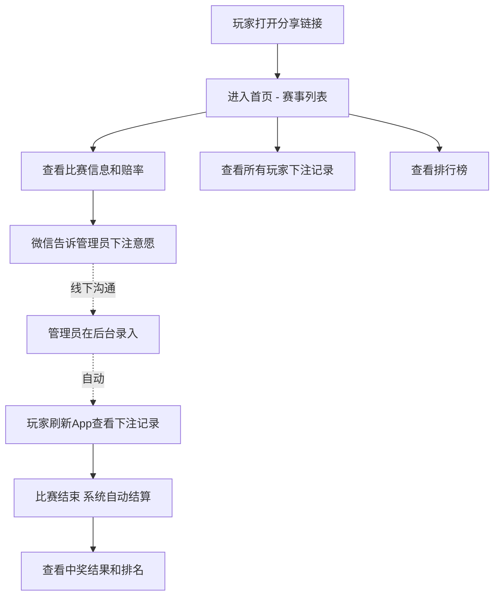
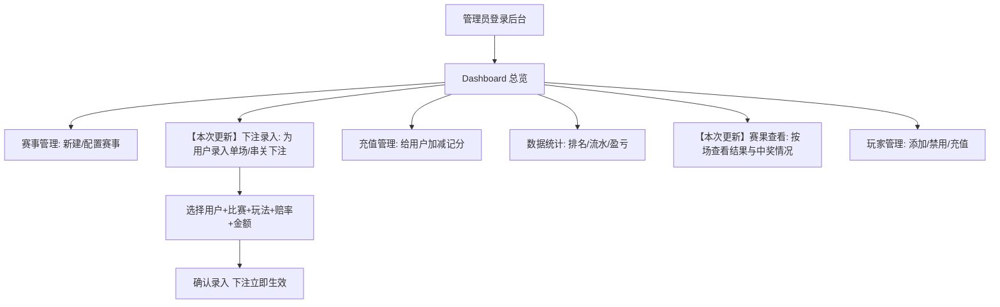

# 嗨起来 — 产品需求文档（PRD）

> > 最后更新：2026-06-13
> 版本：v2.3 【本次更新】管理员后台新增赛果查看 Tab，用于按场查看赛果、玩法命中和下注中奖情况

---

## 1. 产品概述

### 一句话定位

> 这是一个给朋友圈（约20人）用的 Web 竞猜信息平台，用户查看赛事和赔率，管理员统一管理下注录入和结算。
> 与微信群+Excel的方式相比，核心差异是赛程赔率自动展示、下注记录透明可查、排名自动计算。

### 产品形态

- **选型**：Web App（手机端优先适配，桌面端兼容）
- **理由**：分享链接即可参与，无需下载；你是前端工程师，有服务器，开发和部署成本最低
- **生命周期**：长期可复用，支持世界杯/欧洲杯/亚洲杯等任何大赛

### 【本次更新】核心策略变更

**v1.0 策略**：用户在 App 内自行下注，管理员审核
**v2.0 策略**：用户在 App 内**只看**赛事和赔率，通过微信告诉管理员下注内容，管理员在后台**直接录入**下注信息

**变更原因**：简化用户端交互，降低开发复杂度，更符合20人朋友群的实际使用习惯

**变更影响**：
- 移除：下注弹窗、串关购物车、待审核流程、余额不足提示、下注按钮
- 新增：管理员后台的"下注录入"功能
- 保留：赛事赔率展示（只读）、下注记录查看、排名、结算逻辑

### 货币体系

- 虚拟货币"记分"，1:1 人民币
- 不接入任何支付通道，线下转账 + 管理员手动操作
- 获奖后线下兑换礼品

### 赔率来源

- API-Football（RapidAPI），免费档 100次/天即可满足
- 赛事期间按月开通，非赛事期可停用
- 赔率策略：每场比赛仅在前一天拉取一次赔率并锁定，不做实时更新
- 赛果检查：每10分钟检查已结束比赛的赛果

### 技术选型

| 项目 | 选型 |
|------|------|
| 前端框架 | Next.js |
| 后端 | Next.js API Routes（Node.js） |
| 数据库 | PostgreSQL |
| 部署 | Docker |
| HTTPS | Let's Encrypt（微信分享需要） |
| 赔率 API | API-Football |
| OG 分享图 | 支持 |

---

## 2. 目标用户与使用场景

### 用户画像

| 角色 | 人数 | 特征 |
|------|------|------|
| **管理员** | 1人 | 发起人，负责录入下注、充值、管理赛事；你自己 |
| **玩家** | ~20人 | 朋友圈中的球迷或凑热闹的朋友，手机为主 |

### 【本次更新】典型使用场景

**场景 1：玩家查看赛事**

> 小明在地铁上打开分享链接，看到今晚有3场世界杯比赛，赔率已经拉取好了。他看到巴西 vs 德国的主胜赔率 2.10，觉得不错，微信上告诉管理员"巴西胜，200豆"。

**场景 2：管理员录入下注**

> 管理员收到小明的微信，打开后台，在"下注录入"页面选择"巴西 vs 德国"→ 玩法"胜负"→ 选"主胜"→ 输入金额200 → 选择用户"小明"→ 确认。下注立即生效，赔率锁定为 2.10。小明刷新 App 就能看到自己的下注记录。

**场景 3：串关录入**

> 老王微信说"3场串关：巴西胜 + 阿根廷平 + 英格兰客胜，500豆"。管理员在后台选择"串关"模式，依次添加3场比赛和选择，输入金额500，选择用户"老王"→ 确认。综合赔率自动计算为 2.10 × 3.40 × 2.80 = 19.99。

**场景 4：自动结算**

> 比赛结束，系统自动拉取赛果，结算所有下注。小明猜中了，排名页显示他赚了 420 豆。老王串关第二场猜错，标记为未中奖。

**场景 5：赛事切换**

> 世界杯结束了。半年后欧洲杯开始，管理员在后台新建一个"2028欧洲杯"赛事，系统自动从 API-Football 拉取赛程和赔率，无需重新开发。

---

## 3. 【本次更新】核心用户动线

### 玩家流程（无需登录，纯查看）



### 管理员流程（核心操作者）



---

## 4. 【本次更新】功能清单

```
嗨起来
│
├── 📱 用户端（3个页面）
│   ├── 🔴 赛事列表（首页）
│   │   ├── 赛事按日期分组展示
│   │   ├── 比赛卡片（国旗/队徽 + 队名 + 开赛时间 + 状态）
│   │   ├── 赔率展示（胜负/总进球/比分，只读）
│   │   ├── 比赛状态（未开赛/进行中/已结束 + 赛果比分）
│   │   └── 日期切换（查看不同日期的比赛）
│   ├── 🔴 玩家投注
│   │   ├── 我的所有下注记录列表
│   │   ├── 筛选（全部/进行中/已结算）
│   │   ├── 每条记录详情（比赛/玩法/选择/赔率/金额/结果）
│   │   ├── 个人盈亏汇总（余额 + 总盈亏 + 胜率）
│   │   └── 流水明细查看
│   └── 🔴 排行榜
│       ├── 盈亏排行（赚最多的人）
│       ├── 胜率排行（眼光最准的人）
│       └── 每人统计（下注次数/中奖金额/胜率）
│
├── 🖥️ 管理员后台（7个模块）
│   ├── 🔴 1. 下注管理
│   │   ├── 下注录入（单场/串关，选择用户+比赛+玩法+金额）
│   │   ├── 已录入下注列表（全部用户）
│   │   ├── 下注撤销（封盘前可撤销）
│   │   └── 筛选查看（按用户/比赛/状态）
│   ├── 🔴 2. 下注详情
│   │   ├── 单笔下注完整信息（用户/比赛/玩法/赔率/金额）
│   │   ├── 串关明细（各场拆分展示）
│   │   ├── 结算结果（中奖/未中奖/赔付金额）
│   │   └── 操作日志（谁录入/谁撤销/什么时间）
│   ├── 🔴 3. 玩家管理
│   │   ├── 玩家列表（昵称/余额/下注数/盈亏）
│   │   ├── 添加新玩家
│   │   ├── 禁用/启用玩家
│   │   └── 充值管理（给玩家加减记分）
│   ├── 🔴 4. 赛事管理
│   │   ├── 新建赛事（选择联赛/赛季/时间范围）
│   │   ├── 比赛列表（赛程/状态/赔率）
│   │   ├── 赔率管理（API自动拉取 + 手动调整）
│   │   ├── 比赛状态管理（封盘/取消/延期）
│   │   └── 手动录入比赛和赔率
│   ├── 🔴 5. 赛果查看【本次更新】
│   │   ├── 按赛事查看全场/半场比分
│   │   ├── 查看各玩法赛果（胜平负/让球胜平负/比分/总进球/半全场）
│   │   ├── 查看当场所有下注明细
│   │   └── 查看当场中奖情况与赔付汇总
│   ├── 🔴 6. 兑奖管理
│   │   ├── 兑奖申请列表（玩家提交的兑换请求）
│   │   ├── 审核兑奖（通过/拒绝）
│   │   ├── 扣减记分（兑奖通过后扣减余额）
│   │   └── 兑奖记录（历史兑换明细）
│   └── 🔴 7. 统计
│       ├── Dashboard 总览（总下注额/总赔付/活跃人数）
│       ├── 用户盈亏排行
│       ├── 赛事下注分布（哪场比赛下注最多）
│       ├── 平台流水汇总
│       └── 数据导出 CSV
│
└── 🔴 公共能力
    ├── 管理员硬编码登录（环境变量配置用户名密码）
    ├── 自动结算（赛果拉取后自动结算）
    ├── 定时任务（赔率拉取/赛果检查/封盘）
    └── JWT 鉴权（仅管理员）
```

---

## 4.1 【本次更新】关键页面布局线框图

### 用户端 — 赛事列表页（首页，只读）

```
┌─────────────────────────────────┐
│  [嗨起来]    我的余额: ¥1,200    │  ← 顶栏：品牌名 + 记分余额
├─────────────────────────────────┤
│  📅 6月15日 周日        [◀ ▶]    │  ← 日期切换
│  ┌───────────────────────────┐  │
│  │ 🇧🇷 巴西  vs  🇩🇪 德国     │  │  ← 国旗图片来自 ./images/
│  │ 22:00 开赛  |  未开赛      │  │
│  │                           │  │
│  │ 主胜 2.10  平 3.40  客胜 3.00│  ← 赔率只读展示
│  │                           │  │
│  │ [猜比分 ▼] [猜进球数 ▼]   │  ← 展开/收起更多赔率
│  └───────────────────────────┘  │
│  ┌───────────────────────────┐  │
│  │ 🇦🇷 阿根廷 vs 🇫🇷 法国      │  │
│  │ 19:00 开赛  |  已结束 1:2   │  │  ← 已结束显示比分
│  │ 主胜 1.85  平 3.60  客胜 3.80│
│  └───────────────────────────┘  │
├─────────────────────────────────┤
│  [赛事] [我的投注] [排行榜]      │  ← 底部 3个 Tab
└─────────────────────────────────┘
```

### 用户端 — 玩家投注页

```
┌─────────────────────────────────┐
│  [嗨起来]    我的余额: ¥1,200    │
├─────────────────────────────────┤
│  我的投注                        │
│  [全部] [进行中] [已结算]         │
├─────────────────────────────────┤
│  ┌───────────────────────────┐  │
│  │ 巴西 vs 德国               │  │
│  │ 胜负: 巴西胜  @ 2.10       │  │
│  │ ¥200    🔵 进行中           │  │
│  ├───────────────────────────┤  │
│  │ 阿根廷 vs 法国              │  │
│  │ 比分: 1:2  @ 8.50          │  │
│  │ ¥100    🟢 已中奖 +¥750    │  │
│  ├───────────────────────────┤  │
│  │ 串关 3场  综合 19.99        │  │
│  │ ¥500    灰 未中奖 -¥500    │  │
│  └───────────────────────────┘  │
│                                 │
│  [查看流水明细 →]                │
├─────────────────────────────────┤
│  [赛事] [我的投注] [排行榜]      │
└─────────────────────────────────┘
```

### 用户端 — 排行榜页

```
┌─────────────────────────────────┐
│  [嗨起来]    我的余额: ¥1,200    │
├─────────────────────────────────┤
│  排行榜 · 看看谁是预言家         │
│  [盈亏] [胜率]                   │
├─────────────────────────────────┤
│  🥇 1. 小明      +¥1,200        │
│     24注  胜率 68%               │
│  🥈 2. 老王      +¥800          │
│     18注  胜率 55%               │
│  🥉 3. 阿花      +¥500          │
│     20注  胜率 60%               │
│  4. 大胖         -¥100          │
│  ...                            │
│                                 │
│  ── 我的排名 ──                  │
│  第 5 名  -¥250  胜率 45%       │
├─────────────────────────────────┤
│  [赛事] [我的投注] [排行榜]      │
└─────────────────────────────────┘
```

### 管理员后台 — 1. 下注管理

```
┌──────────────────────────────────────────────────────┐
│  [嗨起来 管理后台]           管理员: dhf    [退出]     │
├──────────┬───────────────────────────────────────────┤
│          │  下注管理                                  │
│  1.下注  ├───────────────────────────────────────────┤
│  管理 ← │  [+ 录入下注]                              │
│          │                                           │
│  2.下注  │  筛选: [全部用户▼] [全部状态▼] [搜索____]  │
│  详情    │                                           │
│          │  ┌───────────────────────────────────┐    │
│  3.玩家  │  │ 小明 | 巴西胜 | ¥200 | 进行中     │    │
│  管理    │  │ 6/15 22:00录入  [详情] [撤销]      │    │
│          │  ├───────────────────────────────────┤    │
│  4.赛事  │  │ 老王 | 串关3场 | ¥500 | 已中奖     │    │
│  管理    │  │ 6/14 20:00录入  +¥9,995 [详情]     │    │
│          │  ├───────────────────────────────────┤    │
│  5.兑奖  │  │ 阿花 | 比分1:0 | ¥100 | 未中奖     │    │
│  管理    │  │ 6/14 18:30录入  [详情]              │    │
│          │  └───────────────────────────────────┘    │
│  6.统计  │                                           │
│          │  分页 < 1 2 3 4 5 >                       │
└──────────┴───────────────────────────────────────────┘
```

### 管理员后台 — 录入下注弹窗

```
┌──────────────────────────────────────────────────────┐
│  录入下注                                        [X] │
├──────────────────────────────────────────────────────┤
│  模式:  [● 单场]  [○ 串关]                            │
│                                                      │
│  用户: [搜索用户名/昵称___________] ▼                  │
│                                                      │
│  ── 比赛选择 ──                                       │
│  比赛: [选择比赛___________] ▼                        │
│  玩法: [胜负] [总进球] [比分]                          │
│  选择: [主胜] [平] [客胜]                              │
│  赔率: 2.10（可手动修改）                              │
│                                                      │
│  ── 串关时显示 ──                                     │
│  ✅ 巴西 vs 德国 → 主胜 @ 2.10  [×]                  │
│  ✅ 阿根廷 vs 法国 → 平 @ 3.40  [×]                  │
│  [+ 添加比赛]                                         │
│  综合赔率: 7.14                                       │
│                                                      │
│  ── 金额 ──                                           │
│  下注金额: [__________] 记分                        │
│  预计可赢: ¥1,428                                     │
│                                                      │
│  [取消]                         [确认录入]            │
└──────────────────────────────────────────────────────┘
```

### 管理员后台 — 2. 下注详情

```
┌──────────────────────────────────────────────────────┐
│  [嗨起来 管理后台]                                    │
├──────────┬───────────────────────────────────────────┤
│          │  下注详情 #BET-20260615-001                │
│  1.下注  ├───────────────────────────────────────────┤
│  管理    │                                           │
│          │  用户: 小明 (@xiaoming)                    │
│  2.下注  │  模式: 单场                               │
│  详情 ← │  金额: ¥200                               │
│          │  赔率: 2.10                               │
│  3.玩家  │  预计可赢: ¥420                            │
│  管理    │  状态: 🔵 进行中                           │
│          │                                           │
│  4.赛事  │  ── 下注内容 ──                            │
│  管理    │  比赛: 巴西 vs 德国                        │
│          │  玩法: 胜负                                │
│  5.兑奖  │  选择: 巴西胜                              │
│  管理    │  赔率: 2.10                                │
│          │  开赛时间: 2026-06-15 22:00                │
│  6.统计  │                                           │
│          │  ── 结算信息 ──                            │
│          │  赛果: 待比赛                               │
│          │  中奖金额: -                               │
│          │  结算时间: -                               │
│          │                                           │
│          │  ── 操作日志 ──                            │
│          │  6/15 20:30 管理员dhf 录入                  │
│          │                                           │
│          │  [← 返回列表]  [撤销下注]                   │
└──────────┴───────────────────────────────────────────┘
```

### 管理员后台 — 3. 玩家管理

```
┌──────────────────────────────────────────────────────┐
│  [嗨起来 管理后台]                                    │
├──────────┬───────────────────────────────────────────┤
│          │  玩家管理                                  │
│  1.下注  ├───────────────────────────────────────────┤
│  管理    │  [+ 添加玩家]                                │
│          │                                           │
│  2.下注  │  搜索: [___________]                       │
│  详情    │                                           │
│          │  ┌───────────────────────────────────┐    │
│  3.玩家  │  │ 昵称    │余额   │下注数│盈亏 │操作│    │
│  管理 ← │  │────────────────────────────────── │    │
│          │  │ 小明   │¥1,200│ 24  │+200│充 扣│    │
│  4.赛事  │  │ 老王   │¥800  │ 18  │+800│充 扣│    │
│  管理    │  │ 阿花   │¥500  │ 20  │+500│充 扣│    │
│          │  │ 大胖   │¥900  │ 15  │-100│充 扣│    │
│  5.兑奖  │  │ 小李   │¥200  │ 22  │-300│禁用│    │
│  管理    │  └───────────────────────────────────┘    │
│          │                                           │
│  6.统计  │  点击"充/扣"弹出充值/扣减弹窗               │
└──────────┴───────────────────────────────────────────┘
```

### 管理员后台 — 4. 赛事管理

```
┌──────────────────────────────────────────────────────┐
│  [嗨起来 管理后台]                                    │
├──────────┬───────────────────────────────────────────┤
│          │  赛事管理                                  │
│  1.下注  ├───────────────────────────────────────────┤
│  管理    │  赛事:                                     │
│          │  [2026 FIFA 世界杯 ▼]  [+ 新建赛事]        │
│  2.下注  │                                           │
│  详情    │  ── 比赛列表 ──                             │
│          │  筛选: [全部状态▼] [日期____]               │
│  3.玩家  │                                           │
│  管理    │  ┌───────────────────────────────────┐    │
│          │  │ 🇧🇷巴西 vs 🇩🇪德国                  │    │
│  4.赛事  │  │ 6/15 22:00 | 未开赛                 │    │
│  管理 ← │  │ 赔率: 2.10 / 3.40 / 3.00           │    │
│          │  │ [编辑赔率] [手动录入] [封盘] [取消]  │    │
│  5.兑奖  │  ├───────────────────────────────────┤    │
│  管理    │  │ 🇦🇷阿根廷 vs 🇫🇷法国                 │    │
│          │  │ 6/15 19:00 | 已结束 1:2              │    │
│  6.统计  │  │ 赔率: 1.85 / 3.60 / 3.80           │    │
│          │  │ [编辑赔率] [手动录入]                │    │
│          │  └───────────────────────────────────┘    │
└──────────┴───────────────────────────────────────────┘
```

### 管理员后台 — 5. 赛果查看【本次更新】

```
┌──────────────────────────────────────────────────────┐
│  [嗨起来 管理后台]                                    │
├──────────┬───────────────────────────────────────────┤
│          │  赛果查看                                  │
│  1.下注  ├───────────────────────────────────────────┤
│  管理    │  筛选: [全部日期▼] [全部状态▼] [搜索球队]   │
│          │                                           │
│  2.下注  │  左侧赛事列表                              │
│  详情    │  ┌────────────────────┐  ┌──────────────┐ │
│          │  │ 加拿大 1:1 波黑    │  │ 赛果详情      │ │
│  3.玩家  │  │ 半场 0:1 已结算    │→ │ 全场 1:1      │ │
│  管理    │  ├────────────────────┤  │ 半场 0:1      │ │
│          │  │ 美国 4:1 巴拉圭    │  │ 胜平负: 平    │ │
│  4.赛事  │  │ 半场 3:0 已结算    │  │ 让球: 让负    │ │
│  管理    │  └────────────────────┘  │ 比分: 1:1     │ │
│          │                          │ 总进球: 2球   │ │
│  5.赛果  │                          │ 半全场: 负平  │ │
│  查看 ← │                          ├──────────────┤ │
│          │                          │ 当场下注      │ │
│  6.兑奖  │                          │ 锅锅 让平 WON │ │
│  管理    │                          │ 大神 比分 LOST│ │
│          │                          │ 中奖: 2笔     │ │
│  7.统计  │                          │ 赔付: 42.50   │ │
│          │                          └──────────────┘ │
└──────────┴───────────────────────────────────────────┘
```

### 管理员后台 — 6. 兑奖管理

```
┌──────────────────────────────────────────────────────┐
│  [嗨起来 管理后台]                                    │
├──────────┬───────────────────────────────────────────┤
│          │  兑奖管理                                  │
│  1.下注  ├───────────────────────────────────────────┤
│  管理    │  [待兑奖: 3笔]  [已兑奖: 12笔]             │
│          │                                           │
│  2.下注  │  ── 待兑奖列表 ──                          │
│  详情    │  ┌───────────────────────────────────┐    │
│          │  │ 小明 | 申请兑换 ¥500              │    │
│  3.玩家  │  │ 当前余额: ¥1,200                  │    │
│  管理    │  │ 申请时间: 6/15 22:30              │    │
│          │  │ [通过] [拒绝]                      │    │
│  4.赛事  │  ├───────────────────────────────────┤    │
│  管理    │  │ 老王 | 申请兑换 ¥800              │    │
│          │  │ 当前余额: ¥800                     │    │
│  5.兑奖  │  │ 申请时间: 6/15 23:00              │    │
│  管理 ← │  │ [通过] [拒绝]                      │    │
│          │  └───────────────────────────────────┘    │
│  6.统计  │                                           │
│          │  ── 兑奖记录 ──                            │
│          │  小明 | ¥500 | 已通过 | 6/14               │
│          │  阿花 | ¥300 | 已通过 | 6/13               │
│          │  大胖 | ¥200 | 已拒绝 | 6/12               │
└──────────┴───────────────────────────────────────────┘
```

### 管理员后台 — 7. 统计

```
┌──────────────────────────────────────────────────────┐
│  [嗨起来 管理后台]                                    │
├──────────┬───────────────────────────────────────────┤
│          │  统计                                      │
│  1.下注  ├───────────────────────────────────────────┤
│  管理    │  ┌─────────┐ ┌─────────┐ ┌─────────┐     │
│          │  │总下注额  │ │总赔付   │ │活跃用户 │     │
│  2.下注  │  │¥12,400  │ │¥8,200  │ │18人     │     │
│  详情    │  └─────────┘ └─────────┘ └─────────┘     │
│          │                                           │
│  3.玩家  │  ── 用户盈亏排行 ──                        │
│  管理    │  1. 小明  +¥1,200  24注  胜率68%           │
│          │  2. 老王  +¥800   18注  胜率55%            │
│  4.赛事  │  3. 阿花  +¥500   20注  胜率60%            │
│  管理    │  ...                                     │
│          │                                           │
│  5.兑奖  │  ── 热门比赛（下注最多）──                  │
│  管理    │  1. 巴西 vs 德国 — 18笔 ¥3,600            │
│          │  2. 阿根廷 vs 法国 — 15笔 ¥2,800           │
│  6.统计  │  ...                                     │
│  管理 ← │                                           │
│          │  ── 平台流水 ──                            │
│          │  总充值: ¥20,000  总兑奖: ¥8,200           │
│          │  总中奖: ¥8,200   总下注: ¥12,400          │
│          │                                           │
│          │  [导出 CSV]                               │
└──────────┴───────────────────────────────────────────┘
```

---

## 5. 功能详细描述

### 5.1 用户系统（无变更）

**功能描述**：用户端无需登录注册，打开链接即可查看所有公开信息。管理员通过硬编码账号密码登录后台。玩家由管理员在后台手动添加/管理。

**触发条件**：用户首次打开分享链接，直接进入首页。

**交互细节**：

| 场景 | 交互处理方式 |
|------|------------|
| 操作反馈 | 打开链接直接进入首页，无需等待 |
| 空状态引导 | 无下注记录时显示"暂无投注记录" |
| 操作失败引导 | 无 |

**状态清单**：

| 状态 | 触发条件 | UI 表现 | 用户可执行操作 |
|------|---------|---------|-------------|
| 访客 | 打开链接 | 直接进入首页 | 查看赛事、投注记录、排名 |
| 已禁用 | 管理员禁用 | 该玩家下注记录不再显示 | - |

**数据规范（玩家表 users）**：

| 字段名 | 数据类型 | 长度/大小限制 | 是否必填 | 默认值 | 格式要求 | 校验规则 |
|------|--------|------------|--------|------|--------|--------|
| id | serial | - | 是 | 自增 | - | 主键 |
| username | string | 3-20字符 | 是 | - | 字母数字下划线 | 唯一，不可重复 |
| nickname | string | 2-20字符 | 是 | - | 无特殊字符限制 | 显示名 |
| role | enum | - | 是 | player | admin / player | 仅数据库兼容保留 |
| avatar | string | - | 否 | 默认头像 | URL | 头像图片链接 |
| status | enum | - | 是 | active | active / disabled | 管理员控制 |
| created_at | datetime | - | 是 | 当前时间 | ISO 8601 | - |

**管理员登录**：
- 管理员用户名密码硬编码在环境变量（ADMIN_USERNAME / ADMIN_PASSWORD）
- 登录后 JWT Cookie 鉴权，有效期 7 天
- 仅 `/admin/*` 路由受保护（除 `/admin/login`）

---

### 5.2 【本次更新】赛事与赔率（用户端只读）

**功能描述**：从 API-Football 拉取赛事日程和赔率，按日期分组展示给用户。赔率为只读展示，用户不能在 App 内下注。比赛卡片展示国旗/队徽图片（存放在 `./images/` 目录）。

**触发条件**：用户进入首页。

**交互细节**：

| 场景 | 交互处理方式 |
|------|------------|
| 操作反馈 | 赔率旁显示"已锁定"标签 |
| 危险操作确认 | 无（无交互操作） |
| 空状态引导 | 当天无比赛时显示"今天没有比赛，先歇一天"+ 日期选择器 |
| 操作失败引导 | API 拉取失败时显示"数据暂时无法获取，请稍后刷新"+ 刷新按钮 |

**状态清单（单场比赛展示）**：

| 状态 | 触发条件 | UI 表现 | 用户可执行操作 |
|------|---------|---------|-------------|
| 未开赛 | 当前时间 < 开赛时间 | 显示赔率 + "未开赛"标签 | 仅查看 |
| 进行中 | 比赛进行中 | "进行中" + 实时比分（如 API 支持） | 仅查看 |
| 已结束 | 比赛结束 | 显示赛果比分 | 仅查看 |
| 已取消 | 管理员标记取消 | 显示"已取消" | 仅查看 |

**赔率展示格式**：

| 玩法 | 展示内容 | 示例 |
|------|---------|------|
| 胜负（1X2） | 主胜 / 平 / 客胜 三个赔率 | 2.10 / 3.40 / 3.00 |
| 总进球数 | 0球/1球/2球/3球/4球/5球+，每个赔率 | 0球 8.00, 1球 4.50, 2球 3.20... |
| 比分 | 常见比分选项 + 每个赔率 | 1:0 → 6.50, 1:1 → 5.00, 2:1 → 7.00... |

**【本次更新】图片资源**：
- 国旗/队徽图片存放在项目 `public/images/` 目录
- 命名规则：使用 FIFA 国家代码，如 `br.png`（巴西）、`de.png`（德国）
- 比赛卡片中用 `` 标签展示，替代 emoji
- 如果对应图片不存在，降级显示文字缩写

**赔率策略**：

- 每场比赛在开赛前 **一天** 通过定时任务拉取赔率，拉取后锁定，不再更新
- 用户端展示的就是锁定赔率，纯只读
- 开赛时间到，系统自动将该比赛标记为封盘（对管理员录入生效）
- API 不可用时，管理员可手动录入赔率

**边界条件**：

- API 不可用时：管理员手动录入赔率
- 比赛延期/取消时：管理员手动标记，该场所有下注原路退回
- API-Football 免费额度用尽时：后台告警，管理员可手动录入赔率
- 图片缺失时：降级显示文字缩写，不影响页面功能

**数据规范**：（同 v1.0，赛事表/比赛表/赔率表不变）

---

### 5.3 【本次更新】下注系统 — 管理员录入

**功能描述**：管理员在后台为用户录入下注信息，支持单场和多场串关。录入时选择用户、比赛、玩法、选项，系统自动读取当前锁定赔率，输入金额后确认录入。无单注上限，无串关场次上限。

**触发条件**：管理员在后台点击"下注录入"。

**交互细节**：

| 场景 | 交互处理方式 |
|------|------------|
| 操作反馈 | 录入后 toast "录入成功：{用户} {比赛} ¥{金额}"，显示在最近录入列表中 |
| 危险操作确认 | 金额 > 1000 时弹窗"确认为 {用户} 录入 ¥{金额}？" |
| 空状态引导 | 无比赛可选时"当前没有可下注的比赛" |
| 操作失败引导 | 赔率未拉取时"该比赛暂无赔率数据，请先录入赔率" |

**录入流程**：

1. 管理员选择模式：单场 / 串关
2. 选择用户（支持搜索昵称/用户名）
3. 选择比赛（下拉列表，仅显示未开赛且有赔率的比赛）
4. 选择玩法：胜负 / 总进球 / 比分
5. 选择选项：如"主胜"、"2球"、"1:0"等
6. 系统自动填入当前锁定赔率（管理员可手动修改赔率）
7. 串关模式：重复 3-6 添加多场比赛，系统自动计算综合赔率
8. 输入下注金额
9. 确认录入

**串关规则**：

- 所有选中的比赛必须均为"未开赛"状态
- 综合赔率 = 各场赔率相乘
- 串关中奖条件：所有场次全部猜中才算赢；猜错任何一场则串关输
- 串关中某场比赛取消：该场赔率按 1.00 计算，其余场次正常结算

**撤销机制**：
- 管理员录入后，在比赛封盘前可撤销该笔下注
- 撤销后金额退回用户余额
- 比赛封盘后不可撤销

**状态清单（下注单）**：

| 状态 | 触发条件 | UI 表现 | 管理员可执行操作 |
|------|---------|---------|-------------|
| 已录入 | 管理员确认录入 | 绿色标签"已录入" | 封盘前可撤销 |
| 进行中 | 比赛开始 | 蓝色标签"进行中" | 仅查看 |
| 已中奖 | 结算且猜中 | 绿色 + 金额"+¥XX" | 查看详情 |
| 未中奖 | 结算且未猜中 | 灰色 + 金额"-¥XX" | 查看详情 |
| 已撤销 | 管理员撤销 | 灰色标签"已撤销" | 仅查看 |
| 已退款 | 比赛取消 | 灰色标签"已退款" | 仅查看 |

**边界条件**：

- 下注金额为0或负数：确认按钮灰色
- 比赛已封盘：不可选择该比赛录入
- 赔率未拉取：提示管理员先录入赔率
- 用户不存在：搜索时提示无匹配

**数据规范**：

下注单表（bets）：

| 字段名 | 数据类型 | 长度/大小限制 | 是否必填 | 默认值 | 格式要求 | 校验规则 |
|------|--------|------------|--------|------|--------|--------|
| id | serial | - | 是 | 自增 | - | 主键 |
| bet_uid | string | UUID | 是 | 自动生成 | UUID | 唯一，对外展示用 |
| user_id | int | - | 是 | - | 外键 | 关联用户 |
| bet_mode | enum | - | 是 | - | single / parlay | 单场或串关 |
| total_amount | decimal(10,2) | ≥1 | 是 | - | 正数 | 金额 ≥ 1记分 |
| status | enum | - | 是 | approved | approved / active / won / lost / cancelled | 【本次更新】无 pending_review，直接 approved |
| locked_total_odds | decimal(8,2) | - | 是 | - | - | 串关时为综合赔率，单场时为该场赔率 |
| potential_payout | decimal(10,2) | - | 是 | - | - | 预计可赢 = amount × odds |
| actual_payout | decimal(10,2) | - | 否 | null | - | 结算后填入，未中奖为0 |
| created_by | int | - | 是 | - | 外键 | 录入的管理员 user_id |
| created_at | datetime | - | 是 | 当前时间 | ISO 8601 | - |
| settled_at | datetime | - | 否 | null | ISO 8601 | 结算时间 |

下注明细表（bet_items）：

| 字段名 | 数据类型 | 是否必填 | 说明 |
|------|--------|--------|------|
| id | serial | 是 | 主键 |
| bet_id | int | 是 | 关联下注单（外键） |
| match_id | int | 是 | 关联比赛（外键） |
| bet_market | enum | 是 | 1x2 / total_goals / correct_score |
| selected_option | string | 是 | "home" / "draw" / "away" / "2" / "1:0" 等 |
| locked_odds | decimal(6,2) | 是 | 锁定的赔率 |
| result | enum | 是 | pending / won / lost / cancelled |
| settled_at | datetime | 否 | 该场结算时间 |

---

### 5.4 记分账户（无变更）

**功能描述**：每个用户的记分余额和流水记录。管理员可手动充值/扣减。不接入任何支付通道。

**触发条件**：用户查看"我的"页面，或管理员在后台操作充值。

**交互细节**：

| 场景 | 交互处理方式 |
|------|------------|
| 操作反馈 | 管理员充值后，用户下次打开时余额更新 |
| 危险操作确认 | 管理员扣减余额时弹窗"确认扣减 ¥XX？此操作不可撤回" |
| 空状态引导 | 无流水记录时"还没有交易记录" |
| 操作失败引导 | 无 |

**流水类型**：

| 类型 | 英文标识 | 说明 | 对余额影响 |
|------|---------|------|----------|
| 充值 | recharge | 管理员充值 | +金额 |
| 下注 | bet | 下注扣款（管理员录入时自动扣除） | -金额 |
| 中奖 | win | 中奖发放 | +金额 |
| 退款 | refund | 比赛取消退款 | +金额 |
| 手动调整 | adjust | 管理员手动调整 | +/-金额 |

**边界条件**：

- 余额不允许为负数（管理员强制扣减除外）
- 管理员充值/扣减必须填写备注
- 充值/扣减操作不可撤回，但可以通过反向操作来修正

**数据规范**：（同 v1.0，wallets 表和 transactions 表不变）

---

### 5.5 自动结算与排名（无变更）

**功能描述**：比赛结束后，系统从 API-Football 拉取赛果，自动结算所有相关下注单，中奖的发放记分，更新排名。

**触发条件**：比赛状态变为"已结束"后自动触发。

**结算规则**：

| 玩法 | 中奖条件 | 赔付计算 |
|------|---------|---------|
| 胜负（1X2） | 猜中主胜/平/客胜 | 下注金额 × 锁定赔率 |
| 总进球数 | 猜中全场总进球 | 下注金额 × 锁定赔率 |
| 比分 | 猜中精确比分 | 下注金额 × 锁定赔率 |
| 串关 | 所有场次全部猜中 | 下注金额 × 综合赔率（各场赔率之积） |

**结算流程**：

1. 定时任务每 **10分钟** 检查进行中的比赛，拉取赛果
2. 比赛结束后，匹配所有包含该场比赛的下注明细
3. 逐条判断中奖/未中奖
4. 单场下注：直接结算
5. 串关下注：所有关联比赛均结算完毕后，整体判定串关结果（全部猜中=中奖，任一场未猜中=未中奖）
6. 中奖：发放记分到用户余额，写入流水（type=win）
7. 未中奖：标记为"未中奖"（金额已在录入时扣除，无需额外操作）
8. 更新所有排名缓存

**排名维度**：

| 排名类型 | 排序字段 | 说明 |
|---------|---------|------|
| 盈亏排行 | 累计盈亏 DESC（中奖总额 - 下注总额） | 谁赚最多 |
| 胜率排行 | 胜率 DESC（中奖次数 / 已结算总次数） | 谁眼光最准，最少下注10次才上榜 |

**边界条件**：

- API 赛果延迟：结算状态标记为"待结算"，超过24小时仍未获取到赛果则告警管理员手动录入
- 赛果修正（极罕见）：API 修正了比分，系统重新结算并记录调整流水
- 并发结算：同一比赛的下注单批量处理，使用数据库事务保证一致性
- 串关部分比赛取消：取消场按赔率 1.00 计算，其余正常结算

---

### 5.6 【本次更新】管理员后台

**功能描述**：管理员专属后台。核心操作为**下注录入**（替用户录入下注信息），加上赛事配置、充值、统计等功能。

**触发条件**：管理员登录后进入（role=admin 自动跳转后台）。

**子功能清单**：

| 功能 | 描述 | 操作说明 |
|------|------|---------|
| **【本次新增】下注录入** | 为用户录入单场/串关下注 | 选择用户+比赛+玩法+金额，系统自动读取赔率 |
| **【本次新增】下注撤销** | 封盘前撤销已录入的下注 | 金额退回用户余额 |
| 玩家管理 | 添加/查看/禁用/启用玩家 | 禁用后该玩家记录不再显示 |
| 充值管理 | 给指定用户加/减记分 | 填写金额+备注，必填 |
| 赛事配置 | 新建赛事/选择联赛 ID/设定时间范围 | 从 API-Football 选择联赛 ID，系统自动拉取赛程 |
| 赔率管理 | 查看所有比赛赔率，手动录入/调整 | API 拉取的赔率可手动修改 |
| 比赛状态管理 | 手动标记比赛取消/延期 | 取消触发退款，延期重新安排 |
| **【本次更新】赛果查看** | 按单场比赛查看赛果、玩法结果、下注和中奖情况 | 从赛事列表进入详情，支持按日期/球队筛选 |
| 统计报表 | 总览 Dashboard + 用户排行 + 流水明细 | 可导出 CSV |

**【本次新增】下注录入交互细节**：

| 场景 | 交互处理 |
|------|---------|
| 单场录入 | 选择用户 → 选择比赛 → 选择玩法 → 选择选项 → 输入金额 → 确认 |
| 串关录入 | 选择用户 → 切换串关模式 → 依次添加多场比赛 → 输入金额 → 确认 |
| 赔率手动修改 | 赔率字段可编辑，管理员可修改为自定义赔率 |
| 录入成功 | toast 提示 + 记录出现在"最近录入"列表 |
| 撤销操作 | 在最近录入列表点"撤销"→ 弹窗确认 → 金额退回 |
| 串关综合赔率 | 自动计算并实时显示（各场赔率之积） |

**充值操作交互细节**：

| 场景 | 交互处理 |
|------|---------|
| 充值 | 输入用户名（支持搜索）+ 金额 + 备注 → 确认 → 余额即时更新 |
| 扣减 | 输入用户名 + 金额（正数）+ 备注 → 二次确认 → 余额扣减 |
| 查看流水 | 点击用户 → 显示该用户全部流水记录 |

**【本次更新】赛果查看交互细节**：

| 场景 | 交互处理 |
|------|---------|
| 进入页面 | 默认按开赛时间倒序展示已结束/已结算比赛，未结束比赛可显示“暂无赛果” |
| 筛选赛事 | 支持按日期、球队名称、比赛状态筛选 |
| 查看单场结果 | 点击赛事后进入/展开详情，显示全场比分、半场比分、最终比分（如有） |
| 查看玩法赛果 | 展示胜平负、让球胜平负、比分、总进球、半全场胜平负的实际命中结果 |
| 查看当场下注 | 展示该场所有下注：玩家、玩法、选择、下注倍数/金额、锁定赔率、投注状态 |
| 查看中奖情况 | 汇总中奖笔数、未中奖笔数、总下注额、总赔付额；中奖下注高亮显示 |
| 空状态 | 无符合条件赛事时显示“暂无赛果，可调整筛选条件” |
| 数据未结算 | 比赛有比分但下注仍待结算时显示“赛果已更新，待结算” |

**【本次更新】赛果查看数据规范**：

| 字段名 | 数据类型 | 是否必填 | 默认值 | 说明 |
|------|--------|--------|------|------|
| matchId | number | 是 | - | 比赛 ID |
| homeTeam / awayTeam | string | 是 | - | 主客队名称 |
| homeScore / awayScore | number/null | 否 | null | 90分钟全场比分，用于结算 |
| halfHomeScore / halfAwayScore | number/null | 否 | null | 半场比分，用于半全场玩法 |
| finalHomeScore / finalAwayScore | number/null | 否 | null | 最终比分，仅展示，不参与常规结算 |
| x1xResult | enum | 否 | null | home/draw/away，对应胜平负结果 |
| handicapX1xResult | string | 否 | null | 让球胜平负结果，需带 handicap 值 |
| correctScoreResult | string | 否 | null | 比分结果，如 1:1 |
| totalGoalsResult | string | 否 | null | 总进球结果，如 2球 / 7+ |
| halfFullResult | string | 否 | null | 半全场结果，如 负平 |
| bets | array | 是 | [] | 当场相关下注列表 |
| winCount / loseCount | number | 是 | 0 | 当场中奖/未中奖笔数 |
| totalBetAmount / totalPayout | number | 是 | 0 | 当场总投注与总赔付 |

**边界条件**：

- 管理员不能禁用自己
- 充值/扣减金额不能为0或负数
- 扣减金额不能超过用户当前余额
- 下注录入金额不能为0或负数
- 已封盘的比赛不可录入下注
- 赛果查看中缺少半场比分时，半全场结果显示“缺少半场比分”，不能强行判定
- 赛果查看中没有下注时，下注区域显示“本场暂无下注”
- 已有赛果但未完成结算时，中奖汇总显示“待结算”，不展示错误赔付
- 所有管理操作记录操作者 ID 和时间

---

## 6. 【本次更新】文案规范

### 6.1 文案风格定义

**轻松有趣** — 朋友间的娱乐产品，文案要好玩、有梗、不端着。

### 6.2 面向终端用户的产品文案

| 场景 | 文案内容 | 风格备注 |
|------|---------|---------|
| 首页标题 | 嗨起来 · 今日赛事 | 简洁，品牌露出 |
| 【本次更新】赔率提示 | 赔率已锁定，想下注找管理员 | 引导微信沟通 |
| 中奖结果 | 恭喜！{比赛} 猜中了，+¥{金额} 记分入账 | 有爽感 |
| 未中奖 | {比赛} 没猜中，下次翻盘！ | 鼓励性 |
| 空状态-无比赛 | 今天没有比赛，先歇一天 | 朋友语气 |
| 【本次更新】空状态-无下注 | 还没有下注记录，想玩就跟管理员说 | 引导线下沟通 |
| 排名榜标题 | 排行榜 · 看看谁是预言家 | 有梗 |
| 加载中 | 正在加载赔率... | 简洁 |
| 退款通知 | {比赛} 已取消，¥{金额} 记分已退回 | 清晰明确 |

### 6.3 【本次新增】管理员后台文案

| 场景 | 文案内容 |
|------|---------|
| 录入成功 | 已为 {用户} 录入：{比赛} {选择} ¥{金额} |
| 撤销确认 | 确认撤销这笔下注？¥{金额} 将退回 {用户} 账户 |
| 撤销成功 | 已撤销，¥{金额} 已退回 {用户} 账户 |
| 串关摘要 | 串关 {N}场，综合赔率 {赔率} |
| 【本次更新】赛果查看标题 | 赛果查看 |
| 【本次更新】赛果空状态 | 暂无赛果，可调整筛选条件 |
| 【本次更新】待结算提示 | 赛果已更新，下注仍待结算 |
| 【本次更新】中奖汇总 | 本场中奖 {winCount} 笔，赔付 {totalPayout} |

---

## 7. 非功能性需求（无变更）

- **性能要求**：页面首屏加载 < 2s；赔率接口响应 < 1s；下注录入 < 500ms
- **权限控制**：用户端无需登录，所有页面公开访问；管理员后台通过 JWT Cookie 鉴权，仅硬编码管理员可访问
- **兼容性**：手机端为主（iOS Safari / Android Chrome），桌面端兼容 Chrome/Firefox/Safari
- **数据安全**：管理员密码不存储在数据库（环境变量硬编码）；API 接口 JWT 鉴权；管理员操作通过 remark 字段留痕
- **定时任务**：赔率拉取每天1次、赛果检查每10分钟、封盘处理每5分钟
- **数据存储**：PostgreSQL，所有记录永久保留，20人规模无需考虑高并发
- **部署**：Docker 容器化，建议配置 HTTPS

---

## 8. 【本次更新】变更总结

### 移除的功能
- 用户端下注弹窗（赔率不可点击下注）
- 串关购物车（用户端）
- 待审核流程（管理员直接录入，无需审核）
- 余额不足提示（用户端不涉及下注操作）
- 下注成功/审核通知

### 新增的功能
- 管理员后台"下注录入"页面（单场 + 串关）
- 管理员后台"下注撤销"功能
- 下注单增加 `created_by` 字段（记录录入的管理员）
- 国旗/队徽图片展示（`./images/` 目录）
- 【本次更新】管理员后台“赛果查看”Tab：按场查看赛果、玩法结果、下注和中奖情况

### 简化的流程
- 用户端：赛事列表（只读） → 我的投注（只读） → 排名（只读）
- 管理员端：接收微信下注意愿 → 后台录入 → 系统自动结算
- 下注单状态从 6 种简化为 5 种（去掉了 pending_review）

### 待确认问题
- [x] 平台名称 → 嗨起来
- [x] 记分 → 保留概念，管理员后台管理
- [x] 串关 → 保留，管理员后台录入
- [x] 赔率 API → API-Football
- [x] 用户端下注 → 移除，改为管理员后台录入
- [ ] 国旗/队徽图片来源？手动准备还是从 API-Football 获取？
- [ ] API-Football 的 API Key 是否已注册获取？
- [ ] 服务器配置？
- [ ] 是否配置 HTTPS？
